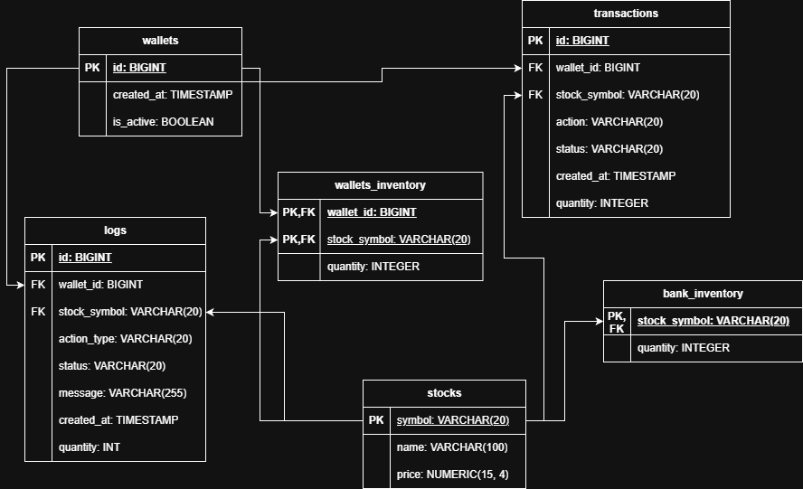

# Simplified Stock Market API

[](https://adoptium.net/)
[](https://spring.io/projects/spring-boot)
[](https://www.postgresql.org/)
[](https://www.docker.com/)
[](https://opensource.org/licenses/MIT)

A simplified stock market simulator developed as recruitment task for Remitly. The application allows users to create wallets, buy and sell stocks, track transaction history, and manage the global stock supply via the Central Bank Inventory.

## API Documentation (Swagger)

A comprehensive specification of all endpoints, data models, and possible HTTP error codes is available in the Swagger UI after starting the application: `http://localhost:<PORT_NUMBER>/swagger-ui.html`.

Main API modules:

- `/wallets` - Wallet creation, executing transactions and checking inventory balances.

- `/stocks` - Initialization and inspection of the Bank's stock supply.

- `/log` - Viewing system audit logs and transaction history.

- `/chaos` - Testing tool for simulating instance shutdowns.

## Database Structure



## Technology Stack

The project is built on a modern Java tech stack, emphasizing containerization and reliable testing environments:

- **Java 21** — Programming language
- **Spring Boot** — Application framework
- **Spring Data JPA** — Data persistence
- **PostgreSQL** — Relational database
- **Flyway** — Database migration management
- **Lombok** — Boilerplate reduction
- **JUnit** - Testing
- **API Documentation** - SpringDoc OpenAPI
- **Docker** — Containerization
- **Docker Compose** — Multi-container orchestration

## Installation & Run Instructions

### Prerequisites

- **Docker Desktop** installed and running
- **Git** for cloning the repository

### Starting the application

1. Clone the repository:

   ```bash
   git clone <repository-url>
   cd stock-market
   ```

2. Start the application and database with a single command with port as a command parameter:
   - Linux:

     ```bash
     ./start.sh <PORT_NUMBER>
     ```

   - Windows:
     ```bash
     start.bat <PORT_NUMBER>
     ```

3. Access the application.
   Once the startup process is complete, the application will be available at:
   - `http://localhost:<PORT_NUMBER>`

### Stopping the application

To gracefully stop and remove all running containers, use:

   ```bash
   docker compose down
   ```

To stop the containers and remove all volumes:

   ```bash
   docker compose down -v
   ```

## Tests

To ensure the reliability and correctness of the application, a comprehensive test suite is provided. This suite includes both unit and integration tests.

The project utilizes **GitHub Actions** to ensure that every code change is safe and does not break existing functionality.
A CI/CD pipeline runs automatically on every `push` and `pull` request to the `main` branch. It sets up a temporary PostgreSQL database, runs the full test suite, and verifies that the Docker images build successfully.

### Running tests locally

You can run the tests locally, using the included wrapper: `./mvnw test`.

## Author

**Konrad Ćwięka** - konrad4cwieka@gmail.com
